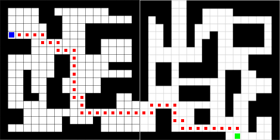

# Indoor_Navigation

### Subject

Develop an Indoor Navigation algorithm without using external infra.

### Objective

- On a 3 story grid-map, detect path coordinates and search the shortest path.
- Visualize the searching process on a 3 story LED-array. 
- Track the user's moving path with Inertia Measurement Unit(IMU).

### Tech

- Image Processing
- Q-Learning
- Pedestrian Dead Reckoning (PDR)

*PDR process is not uploaded here because it is included in other paper.

### Language

- Python
- C (Arduino)
- MATLAB

### My task

- Image Processing
- Serial communication between Raspberry Pi and Arduino
- Combining whole process code

### Result

- Path searching result image :

- PDR result image : 

- Visualized path searching video : https://youtu.be/nz1zmrCpVRI

　

### 세부 내용

- 경로 좌표 추출은 Pillow 라이브러리를 사용하여 다음 과정을 따라 진행된다.

  - Threshold 값을 기준으로 이미지 이진화

  - 격자의 각 칸 안에서 16개 픽셀의 색을 확인

  - 확인한 픽셀들의 절반 이상이 흰색이면 해당 칸을 흰색으로, 아니면 검정색으로 판단

    (흰색: 경로, 검정색: 벽)

- Q-Learning 에서 설정된 변수는 다음과 같다.

  - ε = 0.9
  - γ = 0.99 (discount factor)
  - α = 0.9 (learning rate)

- Q-Learning 이 목표 Episode까지 진행되는 중간 10가지 결과 경로를 Arduino로 전송하여 LED에 표현한다.

